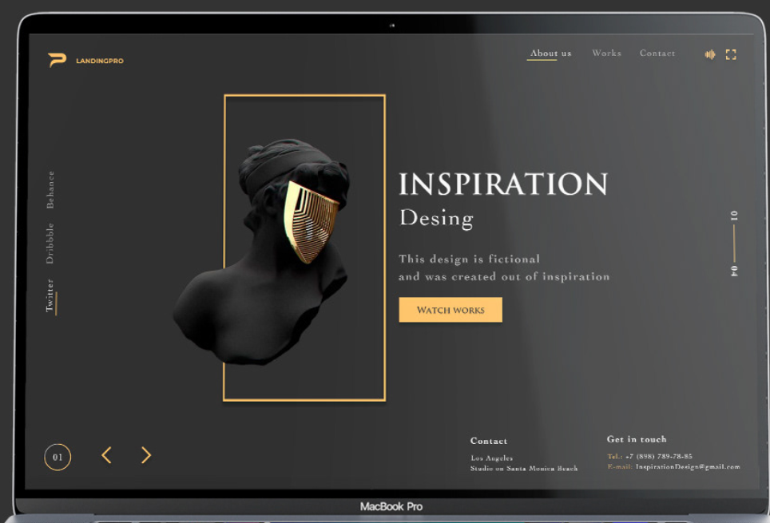
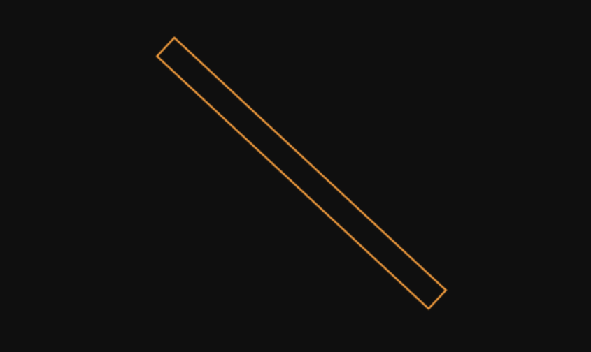

# projet-portfolio
"student at Haute Ecole de la Province de Liège (HEP) based in Liege, Belgium .

project for web design course."

url for the deposit : https://github.com/hepl-dw/projet-portfolio

## Inpiration 

rester dans un coté sobre pas beaucoup de couleur

### Animation 

faire une petite animation de ce style pour mettre mon nom en valeur

peut-etre commencer comme ca? en mettant mon nom, ligne de chargement.

la ligne qui se crée au survol du mot de la liste

j'aime vraiment bcp le ft que quelque chose suit la fleche, je trouve que ca peut ramener vraiment qeulque chose de beau, surtout que je ne veux pas trop charger ma page d'element j'aime quand il n'ya pas bcp de chose, et je pense que ca peut etre bien ca permetrais de ne pas avoir une impression que la page soit vide, comme par exemple dans l'animation juste ci-dessus, quand j'ai visiter cette page internet sans l'animation on peux avoir une impression de trop vide, mais gràce a cette animmation je ne l'ai vraiment pas senti, et je trouve ca beau

le principe que les images s'assombrissent ou s'éclairsivent légerment au survol, ca change des images qui s'agrandissent.

### Typographie

utiliser une police fine a certain endroit style bodoni ou bien script 

Voir une police unpeu de se style j'aime bcp les R et egalement le fait que les lettres soit assez fine

Dans cette image ci je trouve sympa qu'il y ait un text placer à la vertical. surtout quand tout est poser comme ca horizontalement, ca vient unpeu casser le truc.

